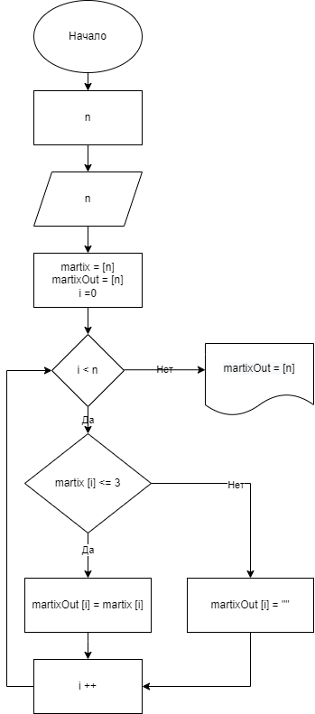

# ИТОГОВАЯ ПРОВЕРОЧНАЯ РАБОТА
## Задача

Из имеющегося массива строк сформировать массив строк, длина которых меньше либо равна 3 символам.
## Решение
Для решения поставленной задачи создаем массив строк случайной длины и со случайным набором символов. Максимальная длина строк и их количество в массиве задаются пользователем. Формирование массива вынесено в отдельный метод.

Далее разработан алгоритм работы программы, блок-схема которого приведена на рисунке.

### Описание работы алгоритма основного блока программы
1. Запрашиваем у пользователя количество строк массива и макимальную длину строки.
---
	Console.WriteLine("Максимальное количество символов в элементе массива: ");
	int symbol = Convert.ToInt32(Console.ReadLine());
	Console.WriteLine("Количество элементов массива: ");
	int element = Convert.ToInt32(Console.ReadLine());

2. Создаем массив строк случайной длины и со случайным набором символов вызовом метода GetArray
---
	string[] matrix = GetArray(symbol, element);

3. Выводим на экран полученный массив.
---
	for (int j = 0; j < matrix.GetLength(0); j++)
	{ Console.Write(matrix[j] + "\t"); }

4. Объявляем новый массив, который будет формироваться из строк длиной не более 3 символов.
---
	string[] matrixOut = new string[element];

5. Формируем новый массив строками длиной не более 3 символов из начального массива.
---
	for (int i = 0; i < element; i++)
	{
	if (matrix[i].Length <= 3) matrixOut[i] = matrix[i];
	else matrixOut[i] = "";
	}

6. Выводим в консоль полученный массив строк
---
	Console.Write("\n" + "Элементы массива с количеством символов <=3: " + "\n");
	for (int j = 0; j < matrixOut.GetLength(0); j++) //вывод массива 2
	{ if (matrixOut[j]!="") Console.Write(matrixOut[j] + "\t"); }
